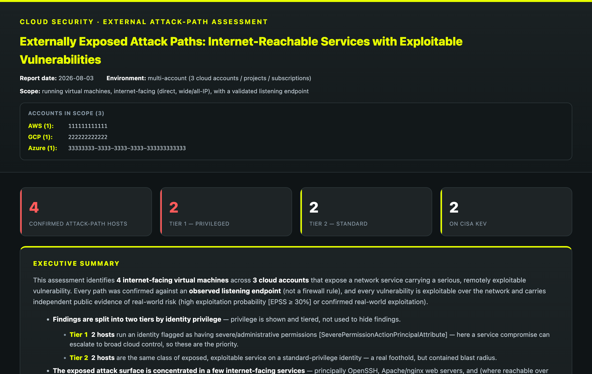

# Cloud External Attack-Path Suite

A repeatable **Tenable Cloud Security** agent that surfaces *genuine externally exposed
attack paths* in a cloud environment using Tenable Cloud Security (UDM / Explore). It
finds running, internet-facing virtual machines whose **observed listening service**
carries a **remotely exploitable** vulnerability backed by **independent public evidence
of real-world risk**, and tiers them by the privilege of the workload's cloud identity —
so the output is a short, high-fidelity list of paths worth acting on, not a raw
vulnerability dump.

> **Why this exists.** A reachable IP:port and a scary CVSS score are not, by themselves,
> an attack path. This tool enforces the full chain — *exposed → a service is really
> listening → the vulnerable component is that service → it is remotely exploitable →
> there is public evidence it matters → the host identity has blast radius* — and is
> deliberately conservative about what counts, so findings are defensible to an owner.

It ships as a **Claude Code plugin marketplace with two agent editions** that share one
self-testing detection spec and one report renderer:

- **`ext-attack-path-agent` (MCP edition)** — runs through the Tenable Cloud Security
  (`tcs`) MCP connector's Explore/UDM tools. Enforces the **full** detection contract
  below. Richest, authoritative results. *Verified end-to-end against a live tenant.*
- **`ext-attack-path-agent-api` (API-token edition, reduced fidelity)** — runs through the
  public GraphQL API with a Bearer token and **no MCP connector**, for headless daily
  runs. The GraphQL API exposes fewer signals, so this edition enforces a **subset** of the
  contract (internet-direct + wide/all exposure, open + AV:N + EPSS/exploit-maturity) and
  **cannot** confirm running-state, an observed listening endpoint, AC:Low, CISA-KEV
  membership, or workload privilege. It produces a **candidate list** and states the gap in
  every report. See that plugin's README for the verified gate-by-gate mapping.

Either edition can run as a scheduled **daily agent** and report the day-over-day delta —
though for large tenants the MCP edition must be scoped per-account/region (its pages route
through model context); the API edition's shell pull scales to any size. See *Scaling*.

> **Fidelity note.** The two editions do **not** produce identical findings — the MCP
> edition is authoritative; the API edition is a lower-fidelity fallback for environments
> without the MCP connector. Both mappings were validated against a live Tenable Cloud
> Security tenant.

---

## Sample report

See exactly what the suite produces before pointing it at your own tenant. The report
below is rendered from a checked-in **synthetic** fixture (all IPs are
[RFC 5737](https://datatracker.ietf.org/doc/html/rfc5737) documentation ranges; all
accounts, roles, and hostnames are fabricated).

[](examples/sample-report.html)

**→ [Open the full rendered report](examples/sample-report.html)** (self-contained HTML) ·
[full-page screenshot](examples/sample-report.png) ·
[how it was generated](examples/README.md)

---

## Table of contents
- [Highlights](#highlights)
- [How a finding qualifies](#how-a-finding-qualifies)
- [What is deliberately excluded](#what-is-deliberately-excluded)
- [Tiering](#tiering)
- [Architecture](#architecture)
- [Editions & running as a daily agent](#editions--running-as-a-daily-agent)
- [Requirements](#requirements)
- [Quick start (synthetic sample)](#quick-start-synthetic-sample)
- [Running a real assessment](#running-a-real-assessment)
- [Extending & maintaining](#extending--maintaining)
- [Security & data handling](#security--data-handling)
- [License](#license)

---

## Highlights

- **Single source of truth.** All detection logic lives in `attack_path_spec.py`, which
  declares the gates as ordered data *and generates every UDM query from that
  declaration* — so the documented logic and the executed query can never drift.
- **Self-testing.** Running the spec fails loudly if a gate is missing or reordered, if a
  deliberately-rejected signal leaks into a filter, if the "not stopped" gate is dropped,
  or if a query GUID is malformed.
- **High-fidelity, not high-volume.** A validated-endpoint requirement plus a
  component-to-port correlation removes local-privilege-escalation and client-side CVEs
  that can't actually be reached over the exposed port.
- **Standards-based thresholds.** Qualification uses public/standard signals (CVSS
  vector attributes, EPSS, CISA KEV) rather than proprietary blended scores.
- **Two-tier output** by identity blast radius, rendered as a self-contained HTML report
  with per-finding attack-path diagrams, evidence, exposed IP:port, and remediation.

---

## How a finding qualifies

A workload is reported only if **all** of the following hold, applied in this order. The
authoritative, self-tested definition is the `GATES` list in `attack_path_spec.py`; the
plain-English description and the underlying attribute are shown together.

| # | Stage | Gate (plain English) | Attribute |
|---|-------|----------------------|-----------|
| 1 | Workload | It is a **running** virtual machine (a stopped VM is not a live path) | `VirtualMachineStatus ≠ Stopped` |
| 2 | Workload | Reachable **directly from the internet** | `EntityNetworkAccessType = ExternalDirect` |
| 3 | Workload | Open to a **wide range of IPs** / the whole internet | `EntityNetworkAccessScope ∈ {Wide, All}` |
| 4 | Exposure | A **live listening service was actually observed** on an internet-facing port (ports come from the validated endpoint, **never** the firewall/security-group rule) | `NetworkEndpoint` exists |
| 5 | Vuln | The finding is **open** (not remediated) | `PackageVulnerabilityInstanceStatus = Open` |
| 6 | Vuln | **Exploitable over the network** | `VulnerabilityAttackVector = Network` |
| 7 | Vuln | **No unusual conditions** required to exploit | `VulnerabilityAttackComplexity = Low` |
| 8 | Vuln | The vulnerable software **is the service on the exposed port** (not a local tool or client program) | component ↔ exposed-port correlation (post-filter) |
| 9 | Evidence | **At least one** public threat signal | `VulnerabilityEpssScore ≥ 0.30` **OR** on CISA KEV |

Gate 8 is the anti-false-positive core: it uses a curated package → service → port map
(`SERVICE_PORTS` in the spec) so, for example, an SSH-only host is a path only if it has a
remote vulnerability *in the SSH server itself* — not in an installed-but-unexposed
library.

**Gate 8 never silently drops an exposed vulnerable service.** It is a three-way decision,
not a keep/drop filter:
- **keep** — a known listening service (SSH, web, DBs, Docker/k8s, mail/DNS/FTP, …) whose
  port is observed exposed → a confirmed path.
- **drop** — a client / library / local tool / OS component (curl, libgnutls, kernel,
  `*-client` sub-packages) → correctly excluded as unreachable-over-the-port.
- **review** — a vulnerable component that maps to *neither* a known service *nor* a known
  non-service → **surfaced in a "Needs review" section**, never discarded. This is the
  anti-false-**negative** safeguard: a coverage gap in `SERVICE_PORTS` (an in-house or
  unusual daemon) can never hide a real internet-facing path — it surfaces for triage, and
  adding it to `SERVICE_PORTS` promotes it to a full finding next run. Component matching is
  token-boundary-aware, so names like `proprietary` don't false-match `tar`.

## What is deliberately excluded

These signals were evaluated and **intentionally not used as qualifying gates**:

- **CVSS base / impact score** — frequently overweighted relative to real-world
  exploitability; as a threshold it admits more noise than signal.
- **VPR score** — this methodology targets the underlying exploitability signals
  (reachability, low attack complexity, exploitation likelihood, confirmed in-the-wild
  use) directly, rather than a single blended score.
- **Proof-of-concept availability** — as a gate it admits lower-impact and older findings
  that do not represent current, high-value exposure. (It is displayed for context, not
  used to qualify.)

**Coverage notes.** The threat-evidence gate relies on **CVE-keyed public sources**
(EPSS, CISA KEV), so findings without a CVE identifier (e.g. distribution advisories such
as `DLA-`/`USN-`) are out of scope by design. The CVE published year shown per finding is
informational only and **never** affects inclusion; non-CVE identifiers display "—".

## Tiering

Privilege is **not** a qualifying gate — it ranks findings so nothing real is hidden:

- **Tier 1 — Privileged Attack Paths:** the workload's identity holds
  severe/administrative permissions (`SeverePermissionActionPrincipalAttribute`). A
  service compromise here can escalate to broad cloud control. **Highest priority.**
- **Tier 2 — Additional Externally Exposed Workloads:** the same class of exposed,
  exploitable service on a standard-privilege identity. A real foothold, contained blast
  radius.

---

## Architecture

```
.claude-plugin/
  marketplace.json    Marketplace manifest listing both plugin editions.
attack_path_spec.py   Single source of truth.
                      • GATES: the ordered gate list (the spec).
                      • build_population_query / build_inventory_query /
                        build_endpoints_query / build_cve_query: every UDM query is
                        generated from GATES, so query ≡ documented logic.
                      • post_filter(): gate 8 (component↔port) + a stopped-VM safety net.
                      • age_label(): CVE-year proxy (fail-open; never filters).
                      • _selftests(): invariants; run `python3 attack_path_spec.py`.
render_report.py      Parameterized renderer (--data, --out, --date). Reads the three
                      datasets, applies post_filter, tiers, and writes the HTML report.
                      Contains no detection thresholds — it defers to the spec.
build.sh              Verifies the spec, SYNCS the shared lib (spec, renderer, queries,
                      sample) into each plugin, and zips each into dist/*.plugin.
queries/              The four spec-generated UDM queries, saved as reference:
                        01_population.json  validate/count the population
                        02_inventory.json   Dataset A — hosts + tier + identity
                        03_endpoints.json   Dataset B — validated IP:port endpoints
                        04_cve.json         Dataset C — per-host qualifying CVEs
plugins/
  ext-attack-path-agent/         MCP edition (tcs connector).
    .claude-plugin/plugin.json
    skills/ext-attack-path/
      SKILL.md                   Agent workflow (pull → assemble → render → daily).
      references/udm-queries.md  The four spec-generated queries, embedded.
      scripts/                   Synced copies of the spec + renderer + sample.
  ext-attack-path-agent-api/     API-token edition (GraphQL Bearer token).
    .claude-plugin/plugin.json
    scripts/tcs_graphql.sh       Bearer-token GraphQL caller (query on stdin).
    run_daily.sh                 Headless scheduling wrapper.
    skills/ext-attack-path-api/
      SKILL.md                   Same contract via GraphQL (introspect → map → pull).
      references/graphql-queries.md  UDM→GraphQL mapping template + skeletons.
cloud-ext-attack-path-suite.md   Tenable Exchange listing (agent front matter + copy).
data/                 Per-assessment inputs (gitignored except data/sample/).
data/sample/          Fully synthetic demo dataset (safe to commit).
output/               Generated HTML reports (gitignored).
dist/                 Built .plugin bundles (gitignored; regenerated by build.sh).
LICENSE               MIT.
```

**Single source of truth, synced not forked.** `attack_path_spec.py`, `render_report.py`,
the reference `queries/`, and the synthetic `data/sample/` live once at the repo root.
`build.sh` copies them into each plugin's bundled `scripts/`/`references/` at build time so
the two editions can never drift from the root spec.

**Data flow:** `queries/*` are executed against your tenant → raw results assembled into
`data/assembled.json` (`{"A":…,"B":…,"C":…}`) → `render_report.py` applies the spec's
post-filter and renders `output/…html`.

## Editions & running as a daily agent

Both editions are Claude Code skills invoked by name. They produce the identical report;
pick by how you connect to Tenable Cloud Security.

| | MCP edition (`ext-attack-path`) | API-token edition (`ext-attack-path-api`) |
|---|---|---|
| **Connects via** | `tcs` MCP connector (Explore/UDM) | Public GraphQL API + Bearer token |
| **Fidelity** | **Full** contract (authoritative) | **Reduced** subset — candidate list (see plugin README) |
| **Best for** | Authoritative, de-noised results | Headless daily cron where no MCP connector exists |
| **Data pull** | `udm_execute_query` (paginated) | GraphQL cursor pagination |
| **Extra setup** | MCP connector configured | `TENABLE_CS_API_URL`, `TENABLE_CS_API_TOKEN` |
| **Verified** | End-to-end vs. live tenant | Queries verified vs. live schema |

**Install locally (either edition):**

```bash
./build.sh                                   # verify spec, sync, and package to dist/
# add this repo as a marketplace, then enable a plugin:
#   /plugin marketplace add /path/to/Cloud-Ext-Attack-Path-Report
#   /plugin install ext-attack-path-agent          (MCP edition)
#   /plugin install ext-attack-path-agent-api       (API-token edition)
```

**Run daily.** The API-token edition ships `plugins/ext-attack-path-agent-api/run_daily.sh`
and a crontab example (see that edition's `SKILL.md`); the MCP edition can be driven by the
Claude Code scheduler. Each run writes a dated report and summarizes the delta from the
prior day. **Scheduling does not change the pull limit** (see below): a scheduled MCP run
still routes every page through the model's context, so for large tenants use the
API-token edition for unattended daily runs, or schedule the MCP skill per-account/region.

**Submit to the Tenable Exchange.** `cloud-ext-attack-path-suite.md` is the listing file
(agent front matter + description). Your code stays in this repo — submit the listing that
points to it via the Exchange's `/cyberagents-exchange-submit` flow or a PR to
[`tenable/cyberagents-exchange`](https://github.com/tenable/cyberagents-exchange).

## Scaling to large environments

The local Python (spec, `assemble.py`, `render_report.py`) is linear/dict-joined and
scales fine; the two limits in a very large environment (10k–50k+ VMs) are the **data
pull** and the **output size**, both addressed:

- **Data pull.** The qualifying-CVE dataset dominates (a ~100-VM lab already yields ~1,800
  rows). MCP `udm_execute_query` calls run **only inside the model context** and can't be
  scripted, so paginating hundreds of thousands of rows inline is infeasible. Always run
  the **count** queries first (`udm_get_query_results_count`) to size the pull. For large
  tenants: either **narrow scope** (per-account/region rule → merge reports) or use the
  API edition's **headless `fetch_all.sh`**, which cursor-paginates and streams each page
  to disk with no model context (verified live), then feed the pages to `assemble_api.py`
  and the shared renderer.
- **Output size.** `render_report.py` caps full per-host cards (`--max-cards`, default 150)
  and CVE rows per host (`--max-cves-per-host`, default 25); overflow hosts roll into a
  compact risk-ranked table while KPI/summary counts stay true to the full set. Measured:
  a 500-host × 20k-CVE render is ~2.4 MB capped vs. ~11 MB uncapped — and an uncapped 50k
  render would exceed **1 GB** (unopenable). `assemble.py --max-hosts N` bounds the set
  earlier still.
- **Renderer memory.** The renderer holds the dataset in memory (there is no stdlib
  streaming-JSON parser, and cross-host KPIs/ranking need the whole set), so peak RSS scales
  with dataset C — measured **~286 MB at ~111k rows**. That's fine for any realistic
  qualifying set; for a pathological single scope with *millions* of rows, bound it: prefer
  `assemble.py --max-hosts N` upstream (keeps `assembled.json` itself small), or
  `render_report.py --max-rows N` (keeps the top-N by CISA-KEV then EPSS and **banners the
  report as truncated** — never a silent cut). True streaming would require a third-party
  JSON parser, which is deliberately avoided to keep the tool dependency-free.

## Operational behavior (for schedulers / unattended runs)

- **Exit codes** (`render_report.py` and the chunked driver): `0` = success (a complete
  report, including the empty-findings and messy-but-renderable cases); `2` = input error
  (missing/malformed `assembled.json`, wrong types — with a clear `ERROR:` message, never a
  traceback); `3` = **report produced but INCOMPLETE** (a chunked run where some
  accounts/regions failed to pull); `1` = total failure (no data pulled). A scheduler can
  branch on these.
- **API retry/backoff.** `tcs_graphql.sh` automatically retries HTTP **429 (throttling)**
  and **5xx** with exponential backoff, honoring `Retry-After` when present
  (`TCS_MAX_RETRIES`, `TCS_BACKOFF_BASE` tunable). Non-retryable 4xx (401/403/400) fail
  fast. A large-tenant pull *will* be rate-limited; this prevents a first-429 abort.
- **Partial-failure tolerance.** In a chunked run, a failed account/region is recorded and
  **skipped**, not fatal — the report is still produced from the scopes that succeeded, with
  a prominent **"INCOMPLETE COVERAGE"** banner listing the missing scopes (never a silent
  partial). Only an all-chunks-failed run aborts.
- **Determinism.** Rendering is a pure function of `assembled.json` + `--date`; two renders
  of the same inputs are byte-identical (query GUIDs are random but live only in generated
  queries, not the report), so reports are diffable/auditable across runs.
- **Schema-drift canary.** The queries depend on specific Tenable field identifiers; if one
  is renamed/removed a query would silently return empty. `attack_path_spec.check_schema()`
  compares the fields the queries need (`REQUIRED_FIELDS`, kept in lockstep with the queries
  by a self-test) against live object-type metadata / GraphQL introspection **before**
  pulling, so a schema change **fails loud** with the exact missing field/type instead of
  producing a deceptively clean report.
- **Actionable remediation.** Every finding gets specific guidance — exact-CVE fixes where
  curated, else per-service advice (patch + port-restriction + hardening) for ~35 services,
  else a component/port-named generic fallback. No unhelpful one-size filler at scale.

## Testing & CI

A dependency-free test suite (`tests/run_tests.sh`) covers the spec self-tests, the
deterministic chunk `plan` CLI, MCP-mode and reduced (`--no-endpoint`) rendering, and the
GraphQL caller's HTTP handling against a local mock (no tenant/token needed). CI
(`.github/workflows/ci.yml`) runs it across a **Python 3.7 → 3.12 matrix** and inside a
**curl 7.64 / jq 1.5 (RHEL8/buster-era) container** — so the documented version floors are
enforced continuously, and a modern-only flag (e.g. `curl --fail-with-body`, which needs
7.76+) can't regress in unnoticed. Run locally with `bash tests/run_tests.sh`.

> Verified on real containers: the suite passes on Python 3.7.17 / 3.8.20 / 3.9.25, and the
> GraphQL caller returns the body on 2xx and fails loud (`HTTP 401`, exit 22) on error on
> curl 7.64.0 + jq 1.5.

## Requirements & runtime dependencies

**Shared (both editions)**
- **Python 3.7+**, standard library only — no third-party packages (`json`, `re`, `uuid`,
  `argparse`, `html`, `os`, `glob`, `datetime`). Type hints are guarded by
  `from __future__ import annotations`, so no PEP 585 runtime-generics issue on 3.7–3.8.
  Invoked as `python3`. Tested on 3.14; floor verified by feature audit (only f-strings).
- Access to a **Tenable Cloud Security** tenant.

**MCP edition** (`ext-attack-path-agent`)
- The **`tcs` MCP connector** (UDM / Explore `udm_execute_query`). No shell tooling beyond
  Python is required for the core; the optional `run_chunked.sh` driver needs **bash 3.2+**
  and the **`claude` CLI** (for headless per-account runs).

**API-token edition** (`ext-attack-path-agent-api`)
- **bash 3.2+** (macOS default; no bash-4 features used), **curl**, **jq 1.5+**.
- Portable by design: no GNU-only flags, no `curl --fail-with-body` (which needs curl
  7.76+); HTTP errors are checked via `-w` so it works on RHEL7/8-era curl. `date`, `seq`,
  `split -l` use POSIX-portable options only (GNU **and** BSD/macOS).
- A **Tenable Cloud Security API token** (`TENABLE_CS_API_URL`, `TENABLE_CS_API_TOKEN`).

> The **README states 3.7 as the floor conservatively**; if your fleet standardizes on a
> newer Python that's fine — nothing requires it. There are **no pinned package versions**
> because there are no third-party packages.

## Quick start (synthetic sample)

No real data or tenant access needed — a fabricated dataset ships under `data/sample/`
(documentation IP ranges per RFC 5737):

```bash
# 1) verify the detection logic (must print: ALL SELF-TESTS PASSED)
python3 attack_path_spec.py

# 2) render the sample report
python3 render_report.py --data ./data/sample --out ./output/sample-report.html
open ./output/sample-report.html      # macOS (use xdg-open on Linux)
```

The sample intentionally includes one non-listening library CVE (`libgnutls30`) to
demonstrate the component-to-port exclusion removing it.

## Running a real assessment

1. **Validate the logic:**
   ```bash
   python3 attack_path_spec.py
   ```
   Confirm it prints `ALL SELF-TESTS PASSED`; it also prints the gate order and the
   generated queries.

2. **Pull the data** for your tenant by executing the queries in `queries/` (or
   regenerating them with the spec's `build_*` functions) via the UDM API, paginating
   fully. Assemble the raw match arrays into `data/assembled.json`:
   - **A** — `build_inventory_query()`: one row per host. Set `privileged` from whether
     `EntityAttributes` contains `SeverePermissionActionPrincipalAttribute`; capture
     `OriginatorEntityServiceIdentities` for the identity.
   - **B** — `build_endpoints_query()`: dedupe to
     `[{instance_id, name, ports:[{port, protocol}]}]`. Optionally also write
     `data/endpoint_ips.json` (`{"endpoints":[{name, ip, port, protocol}]}`) to show the
     exact IP:port in each finding.
   - **C** — `build_cve_query()`: **parse the package from the 2nd path segment of the
     instance Id** and carry it as `component`. The renderer applies gate 8 to these rows
     via `attack_path_spec.post_filter()`.

3. **Render:**
   ```bash
   python3 render_report.py --data ./data --date $(date +%F) \
       --out ./output/attack-paths-report.html
   ```

> A future enhancement could automate step 2 with a small fetch script that calls the API
> and writes `assembled.json` directly.

### Printing to PDF

The report ships with a print stylesheet, so no extra tooling is needed. Open the HTML in
a browser and choose **File → Print → Save as PDF**:

- Paper **Letter or A4**, default margins.
- Enable **"Background graphics"** so severity colors render.

On print, the on-screen dark theme automatically switches to a **high-contrast,
ink-friendly light palette**, each tier starts on a fresh page, and findings (cards,
diagrams, table rows) are kept from splitting across page breaks — so it reads like a
professional printed report. Generating a separate PDF file per run is intentionally
*not* built in: it would require a heavyweight headless-browser/PDF dependency, whereas
the print stylesheet keeps the tool dependency-free and always in sync with the HTML.

## Extending & maintaining

- **Change a threshold or add a gate:** edit the `GATES` list (and, if needed,
  `SERVICE_PORTS`) in `attack_path_spec.py`. The self-tests enforce gate ordering, the
  no-rejected-signal rule, valid hex GUIDs, and that the stopped-VM exclusion stays gate
  #1. If you weaken an invariant, `python3 attack_path_spec.py` fails loudly.
- **Add a listening service** (e.g. a new web/app server): add it to `SERVICE_PORTS` and
  the keep-list in `component_is_listening()` / `service_key()`, and add a unit assertion.
- Because every query is generated from the same gate declaration, the query and the
  documented logic **cannot** diverge.

## Security & data handling

- **Never commit real assessment data.** `data/` and `output/` are gitignored (only
  `data/sample/` is tracked), and `.gitignore` additionally blocks common secret/key
  file types and ad-hoc pull artifacts. Real cloud account IDs, hostnames, public IPs,
  service-account identifiers, and findings must stay out of version control.
- Diagrams depict a *plausible* exploitation chain, not confirmed compromise.
- **The HTML report is injection-safe.** Every value sourced from the environment (VM
  names, identities, tenant IDs, components, CVE IDs, IP:port) is HTML-escaped before it
  enters the report body or the inline SVG — a workload literally named
  `<script>…</script>` renders as inert text. This is verified by an adversarial DOM-level
  test in the CI suite (payloads in every field → asserts no event-handler attribute on any
  element and no script execution).
- Validate the environment's classification (prod vs. lab) before acting on findings or
  filing remediation tickets.

## License

[MIT](./LICENSE) © 2026 Tenable, Inc.
